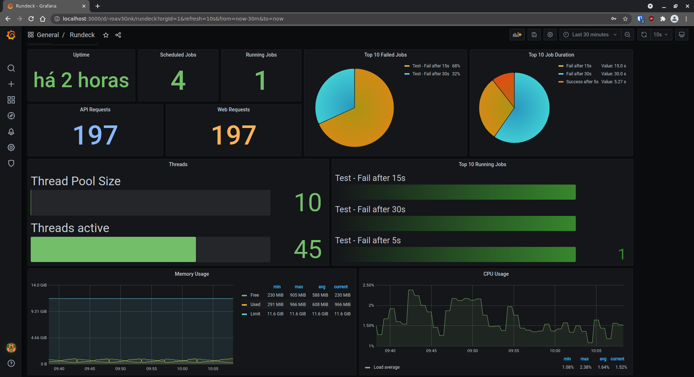
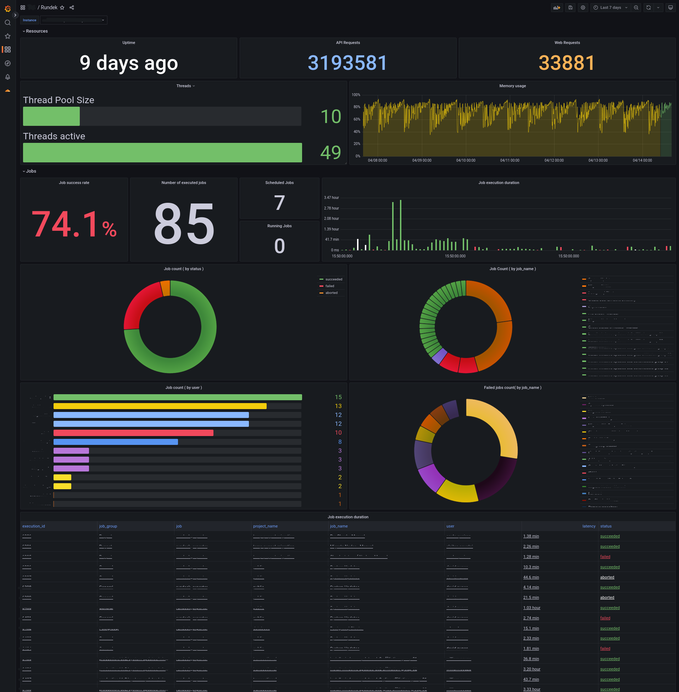

## Rundeck Exporter Grafana Dashboard
---

Below is a example of a Grafana Dashboard.

The following parameters are required to make the dashboard works as in the image:
- rundeck.projects.executions
- rundeck.cpu.stats
- rundeck.memory.stats

The dashboard can be imported from the following JSON file:

[Rundeck Grafana Dashboard JSON](Rundeck-Dashboard.json)



<br>

## Rundeck Exporter Grafana Dashboard - Detailed jobs
The dashboard bellow includes some detailed information about jobs executions.

The following parameters are required to make the dashboard works as in the image:
- rundeck.projects.executions
- rundeck.cpu.stats
- rundeck.memory.stats

Need to change the Grafana variable ```rundeck_host``` for the links to work as expected.

[Dashboard JSON file](rundeck-exporter-job-detailed.json)

