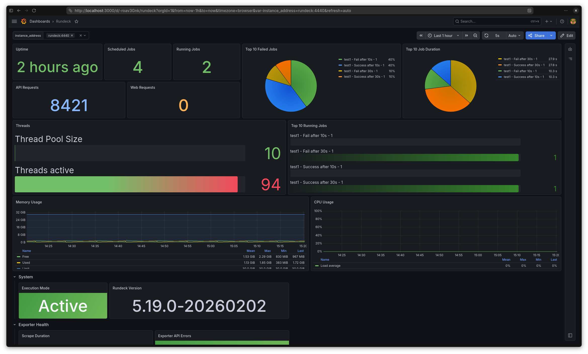
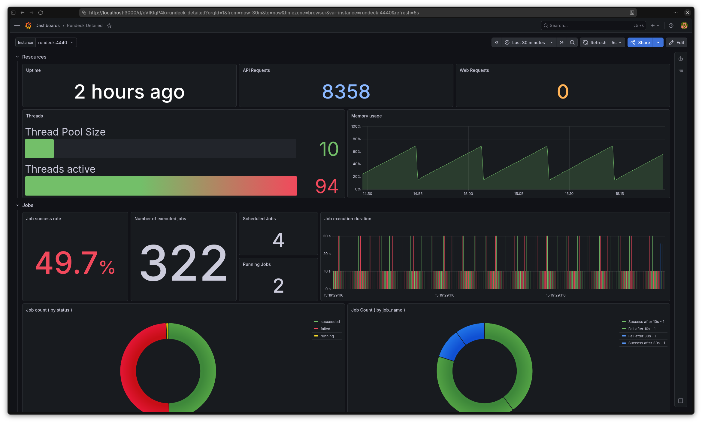
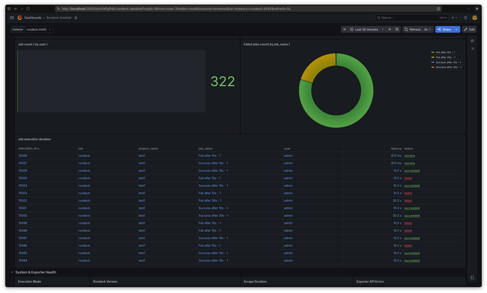

# Rundeck Exporter Grafana Dashboards

Two dashboards are provided. Import them via **Grafana → Dashboards → Import → Upload JSON file**.

## Rundeck Dashboard

Overview of Rundeck system resources and job activity.

**File:** [rundeck-dashboard.json](rundeck-dashboard.json)

**Variable:** `instance_address` — populated automatically from `label_values(instance_address)`. Select the Rundeck server address (e.g. `rundeck:4440`).

**Recommended flags:**
- `--rundeck.projects.executions`
- `--rundeck.cpu.stats`
- `--rundeck.memory.stats`

## Rundeck Detailed Dashboard

Per-job execution breakdown with success rate, duration, failure analysis, and running job tracking.

**File:** [rundeck-exporter-job-detailed.json](rundeck-exporter-job-detailed.json)

**Variable:** `instance` — populated automatically from `label_values(instance_address)`. Select the Rundeck server address (e.g. `rundeck:4440`).

Set the `rundeck_host` constant variable to your Rundeck base URL for job detail links to work (e.g. `http://rundeck:4440`).

**Recommended flags:**
- `--rundeck.projects.executions`
- `--rundeck.cpu.stats`
- `--rundeck.memory.stats`

